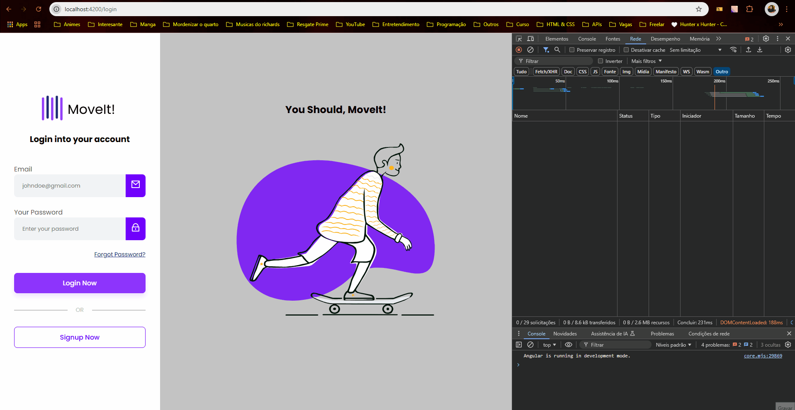

# LoginPage

Projeto criado para praticar com o Framework Angular e criando o backend em Java, apesar de não dominar fui atras de varias informações para conseguir chegar no resultado que cheguei.

No momento o projeto não tem um banco de dados, os dados são salvos na memoria local para fazer os testes da aplicação.

## Funcionalidades
- Criação de usuário.
- Login de usuário.
- Acesso a pagina de usuário apenas quando feito o login. Quando tentando entrar na tela do usuário sem fazer o login, é redirecionado a tela de login

## Ferramentas Utilizadas
### Framework
- Angular
    - A versão utilizada do angular foi a 17.3.0 pois foi as informações mais completas que encontrei no momento para poder fazer a aplicação.

### Linguagens
1. HTML
    - Foi utilizado o HTML para criação das telas do projeto para ser manipuladas pelo Angular como SPA(Single Page Application).
---
2. SCSS
    - Para a estilização foi utilizando o SCSS pois queria entender a diferença dele para o CSS puro e gostei muito da forma de organizar a estilização dele.
---
3. TypeScript
    - Utilizando o framework angular não podemos utilizar o JavaScript, temos que utilizar o TypeScript junto desse framework para poder criar as funcionalidades da nossa aplicação.

## Apresentação da aplicação

